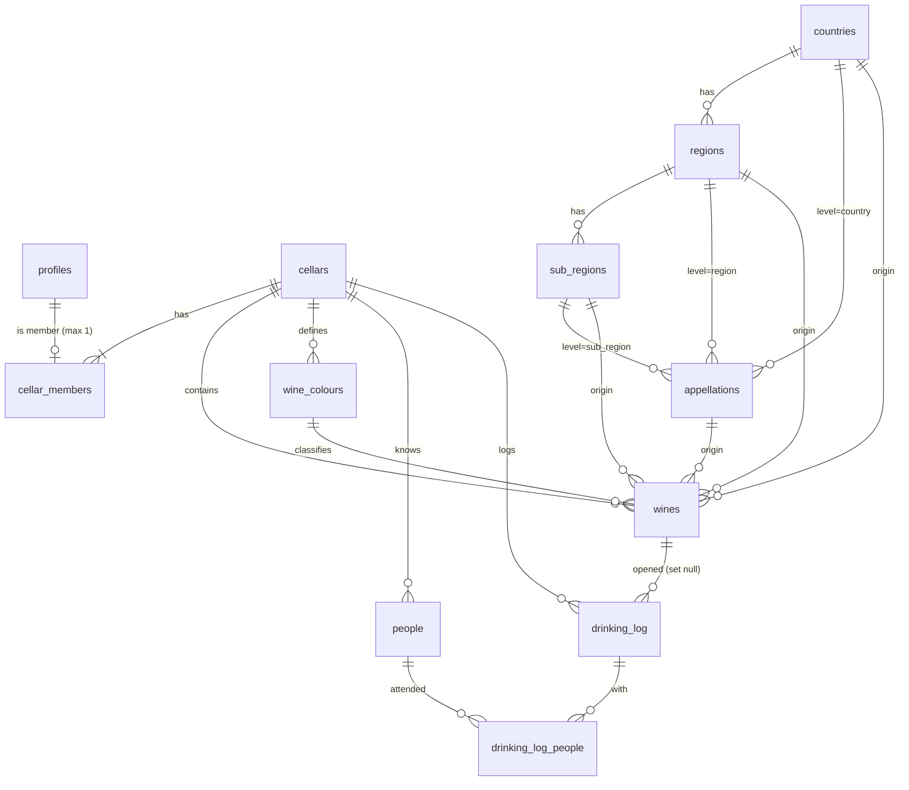

# My Wine Cellar — Rebuild-Plan (v2)

> **Status:** FREIGEGEBEN — Umsetzung läuft (Start 2026-07-07 mit Phasen 0–3) · Erstellt 2026-07-06
> Feature-Auswahl fixiert (Anhang C) · Daten-Audit liegt vor (Abschnitt 8.0)
> **Zweck:** Grundgerüst für den sauberen Neuaufbau der App. Dieses Dokument ist der
> verbindliche Bauplan; die Umsetzung erfolgt phasenweise (Abschnitt 9) durch Claude
> (Opus) in separaten Sessions. Jede Phase hat Akzeptanzkriterien.

---

## 1. Ziel & Prinzipien

**Ziel:** Dieselbe App — Weinkeller-Verwaltung mit Label-Scan, Trink-Historie und
CSV-Import — aber auf einem sauberen Fundament: ein konsistentes Datenmodell ohne
doppelte Wahrheiten, reproduzierbare Migrationen, ein geteilter Familien-Keller statt
Einzel-User, und eine **vollständige weltweite Geografie-/Appellations-Hierarchie**,
die echt mit den Weinen verknüpft ist.

**Prinzipien:**

1. **Eine Wahrheit pro Information.** Geografie nur als FK, nie parallel als Freitext.
2. **Alles in Migrationen.** Die DB muss aus dem Repo reproduzierbar sein (inkl.
   `profiles`, Trigger, RLS, RPCs). Kein manuelles Dashboard-Gefrickel.
3. **Referenzdaten als Daten, nicht als SQL.** Die Weltgeografie lebt als versionierte
   JSON-Dateien im Repo + Generator-Script — reviewbar, diffbar, erweiterbar.
4. **Frontend folgt dem Modell.** Feature-Ordner, typisierte Formulare, ein
   Datenlayer-Muster (React Query) konsequent überall.
5. **Kein Datenverlust.** Bestehende Weine, Personen, Historie und Fotos werden
   migriert (Abschnitt 8), mit Dry-Run und Validierung vor dem echten Lauf.

**Nicht-Ziele (bewusst außen vor):** Mehrere Keller pro User, öffentliches
Sharing/Community-Features, Mobile-App, i18n (UI bleibt Englisch), Offline-Modus.

---

## 2. Getroffene Grundsatz-Entscheidungen

| # | Entscheidung | Konsequenz |
|---|---|---|
| E1 | **Volle 4-Ebenen-Geografie** (Country → Region → Sub-Region → Appellation) | Hierarchie-Tabellen bleiben, werden aber via FKs echt an `wines` gebunden; Freitext-Duplikate entfallen |
| E2 | **Geteilter Familien-/Gruppenkeller** | Neues `cellars` + `cellar_members`-Modell; RLS auf Mitgliedschaft statt `auth.uid() = user_id`; ersetzt das `profiles.approved`-Gate durch Invite-Codes |
| E3 | **Ein Keller pro User** | `UNIQUE(user_id)` auf `cellar_members`; kein Keller-Umschalter im UI; aktiver Keller = abgeleitet aus Mitgliedschaft |
| E4 | **Bestehende Daten migrieren** | Export → Transform-Script (Text→FK-Auflösung) → Import; Fotos bleiben im selben Bucket |
| E5 | **Geografie-Datensatz weltweit vervollständigen** | Eigener Workstream (Abschnitt 5); Ziel ~1'400–1'500 Appellationen, aktuell ~550–600 |

**Stack bleibt:** Vite + React 18 + TypeScript + shadcn/ui + Tailwind + React Query +
Supabase (Auth, Postgres, Storage, Edge Functions). Kein Framework-Wechsel — das
Fundament ist gut, nur der Aufbau darauf war unsauber.

---

## 3. Zielarchitektur — Überblick

```
┌────────────────────────────── Browser (Vite/React) ──────────────────────────────┐
│  features/* (auth, wines, wine-form, geography, history, people, import, members) │
│  React Query  ←→  api/-Module (reine Funktionen)  ←→  supabase-js (typed client)  │
└──────────────────────────────────────┬────────────────────────────────────────────┘
                                       │ RLS: cellar_id = current_cellar_id()
┌──────────────────────────────────────┴────────────────────────────────────────────┐
│ Supabase                                                                           │
│  Postgres: cellars/members · wines · geo-Referenz (global) · colours · people ·    │
│            drinking_log  — alles aus Migrationen reproduzierbar                    │
│  Storage:  wine-photos ({cellar_id}/{uuid}.ext)                                    │
│  Edge Fn:  claude-assistant v2 (JWT-verifiziert, Tool-Use-JSON, aktuelles Modell)  │
└────────────────────────────────────────────────────────────────────────────────────┘
```

---

## 4. Datenmodell v2 (verbindlich)

### 4.1 Identität & Mitgliedschaft

```sql
-- Ersetzt die manuell angelegte Live-Tabelle; diesmal in Migrationen!
create table public.profiles (
  id            uuid primary key references auth.users(id) on delete cascade,
  display_name  text,
  email         text,
  created_at    timestamptz not null default now(),
  updated_at    timestamptz not null default now()
);
-- Trigger handle_new_user() on auth.users → legt Profil automatisch an.

create table public.cellars (
  id           uuid primary key default gen_random_uuid(),
  name         text not null,
  invite_code  text not null unique,          -- z. B. 8-stellig, regenerierbar
  created_by   uuid references public.profiles(id),
  created_at   timestamptz not null default now(),
  updated_at   timestamptz not null default now()
);

create table public.cellar_members (
  cellar_id   uuid not null references public.cellars(id) on delete cascade,
  user_id     uuid not null references public.profiles(id) on delete cascade,
  role        text not null default 'member' check (role in ('owner','member')),
  created_at  timestamptz not null default now(),
  primary key (cellar_id, user_id),
  unique (user_id)                            -- ← erzwingt E3: ein Keller pro User
);
```

**Kern-Helper für RLS** (macht alle Policies trivial):

```sql
create or replace function public.current_cellar_id()
returns uuid language sql stable security definer set search_path = public
as $$ select cellar_id from cellar_members where user_id = auth.uid() $$;
```

**RPCs (atomar, SECURITY DEFINER):**
- `create_cellar(p_name text) → uuid` — legt Keller + Owner-Membership in einer
  Transaktion an; schlägt fehl, wenn der User schon Mitglied irgendwo ist.
- `join_cellar(p_invite_code text) → uuid` — tritt per Code bei; gleiche Guards.
- `regenerate_invite_code() → text` — nur Owner.

**Onboarding-Flow (ersetzt das Approval-Gate):** Nach Signup landet ein User ohne
Mitgliedschaft auf einer Onboarding-Seite: *„Create a cellar"* oder *„Join with
invite code"*. Optional (empfohlen, sobald alle Familienmitglieder registriert sind):
öffentliche Signups in den Supabase-Auth-Settings deaktivieren.

### 4.2 Geografie-Referenz (global, ohne user_id/cellar_id!)

Referenzdaten gehören niemandem — sie sind Weltwissen. Lesbar für alle
authentifizierten User; Einfügen/Ändern ebenfalls für authentifizierte User erlaubt
(pragmatisch für den Familien-Kontext; Unique-Constraints sichern Konsistenz).

```sql
create table public.countries (
  id          uuid primary key default gen_random_uuid(),
  name        text not null unique,
  code        text,                       -- ISO 3166-1 alpha-2 ('FR', 'CH', …)
  continent   text,
  sort_order  int not null default 0
);

create table public.regions (
  id          uuid primary key default gen_random_uuid(),
  country_id  uuid not null references public.countries(id) on delete cascade,
  name        text not null,
  sort_order  int not null default 0,
  unique (country_id, name)
);

create table public.sub_regions (
  id          uuid primary key default gen_random_uuid(),
  region_id   uuid not null references public.regions(id) on delete cascade,
  name        text not null,
  sort_order  int not null default 0,
  unique (region_id, name)
);

create table public.appellations (
  id             uuid primary key default gen_random_uuid(),
  -- Genau EIN Parent ist gesetzt; `level` benennt ihn (CHECK-Constraint):
  level          text not null check (level in ('country','region','sub_region')),
  country_id     uuid references public.countries(id)    on delete cascade,
  region_id      uuid references public.regions(id)      on delete cascade,
  sub_region_id  uuid references public.sub_regions(id)  on delete cascade,
  name           text not null,
  type           text,        -- 'AOC','AOP','DOCG','DOC','DO','DOCa','AVA','GI','WO','DAC','VDP','IGT','IGP', …
  sort_order     int not null default 0,
  check (
    (level = 'country'    and country_id is not null and region_id is null and sub_region_id is null) or
    (level = 'region'     and region_id  is not null and country_id is null and sub_region_id is null) or
    (level = 'sub_region' and sub_region_id is not null and country_id is null and region_id is null)
  )
);
-- Unique-Index über (name, level, parent), analog zum bisherigen Partial-Index.
```

Damit sind Appellationen auf jeder Ebene andockbar: *Vin de France* am Land,
*Bourgogne AOC* an der Region, *Margaux AOC* an der Sub-Region Médoc.

### 4.3 Kellerdaten

```sql
create table public.wine_colours (
  id            uuid primary key default gen_random_uuid(),
  cellar_id     uuid not null references public.cellars(id) on delete cascade,
  name          text not null,          -- slug, Key für eingebautes Styling
  display_name  text not null,
  sort_order    int not null default 0,
  created_at/updated_at,
  unique (cellar_id, name)
);
-- Trigger: after insert on cellars → 6 Default-Farben seeden
-- (sparkling, white, red, rose, orange, dessert_fortified).

create table public.wines (
  id              uuid primary key default gen_random_uuid(),
  cellar_id       uuid not null references public.cellars(id) on delete cascade,
  created_by      uuid references public.profiles(id),
  -- Identität
  producer        text,
  name            text,                 -- vorher `description` (Cuvée-/Weinname)
  vintage         text,                 -- text wegen 'NV', 'MV'
  colour_id       uuid references public.wine_colours(id) on delete set null,
  variety         text,
  -- Kennzahlen
  size_ml         int,                  -- vorher `cl` (integer!, 37.5 ging verloren) → 375, 750, 1500 …
  alcohol_pct     numeric,
  residual_sugar_gl numeric,
  dosage          text,
  -- Geografie: nur FKs, KEINE Textspalten mehr. Tiefste gesetzte Ebene zählt;
  -- ein BEFORE-Trigger füllt die Vorfahren automatisch konsistent auf.
  country_id      uuid references public.countries(id)     on delete set null,
  region_id       uuid references public.regions(id)       on delete set null,
  sub_region_id   uuid references public.sub_regions(id)   on delete set null,
  appellation_id  uuid references public.appellations(id)  on delete set null,
  -- Freitexte
  terroir_notes   text,                 -- vorher `ausbau_terroir`
  notes           text,
  -- Verwaltung
  occasion        text check (occasion in ('anytime','special','lay_down','top')),  -- vorher 'a','t','l','T'
  quantity        int not null default 1 check (quantity >= 0),
  price_chf       numeric,
  purchased_from  text,
  ready_from      int,
  drink_by        int,
  rating          int check (rating between 1 and 5),
  storage_location text,               -- V1: z. B. „Regal B / Fach 3"
  label_photo_path text,                -- Storage-PFAD, nicht volle URL
  created_at/updated_at
);
-- Indexe: (cellar_id), (cellar_id, colour_id), (country_id), (region_id), (appellation_id)

create table public.people (
  id          uuid primary key default gen_random_uuid(),
  cellar_id   uuid not null references public.cellars(id) on delete cascade,
  name        text not null,
  avatar      text,
  created_at  timestamptz not null default now()
);

create table public.drinking_log (
  id          uuid primary key default gen_random_uuid(),
  cellar_id   uuid not null references public.cellars(id) on delete cascade,
  wine_id     uuid references public.wines(id) on delete set null,
  wine_label  text,                     -- Snapshot "Producer — Name Vintage" beim Öffnen
  date        date not null default current_date,
  note        text,
  rating      int check (rating between 1 and 5),  -- V6: „Wie war er?" beim Öffnen
  opened_by   uuid references public.profiles(id),
  created_at  timestamptz not null default now()
);

-- Ersetzt das FK-lose Array people_ids uuid[]:
create table public.drinking_log_people (
  log_id     uuid not null references public.drinking_log(id) on delete cascade,
  person_id  uuid not null references public.people(id)       on delete cascade,
  primary key (log_id, person_id)
);
```

### 4.4 RLS-Matrix

| Tabelle | SELECT | INSERT/UPDATE/DELETE |
|---|---|---|
| `profiles` | eigenes Profil | eigenes Profil (update) |
| `cellars` | Mitglieder | Update: Owner; Insert nur via RPC |
| `cellar_members` | Mitglieder desselben Kellers | Owner (delete); Insert nur via RPC |
| `wines`, `wine_colours`, `people`, `drinking_log`, `drinking_log_people` | `cellar_id = current_cellar_id()` | dito |
| `countries/regions/sub_regions/appellations` | alle authentifizierten | alle authentifizierten (Familien-Pragmatik) |
| Storage `wine-photos` | public read (Abwägung s. Abschnitt 10) | Schreiben nur in Ordner `{current_cellar_id()}/…` |

### 4.5 Trigger & Funktionen (vollständige Liste)

1. `set_updated_at()` — generisch, auf allen Tabellen mit `updated_at` (wie bisher).
2. `handle_new_user()` — `after insert on auth.users` → Profil anlegen.
3. `seed_cellar_defaults()` — `after insert on cellars` → Default-Farben.
4. `wines_fill_geo_ancestors()` — `before insert/update on wines` → aus der tiefsten
   gesetzten Geo-Ebene die Vorfahren ableiten (Konsistenz + schnelle Filter).
5. RPCs: `create_cellar`, `join_cellar`, `regenerate_invite_code`,
   `reorder_rows(p_table, p_ids)` (Whitelist-basiert, ersetzt N Einzel-Updates).

---

## 5. Workstream Geografie: Weltweite Appellations-Abdeckung

### 5.1 Ist-Zustand (Audit vom 2026-07-06)

- v1 hatte die Daten in zwei handgeschriebenen SQL-Seeds (127 KB + 24 KB), einem
  zufälligen User zugewiesen. **Am 2026-07-07 maschinell nach JSON konvertiert:
  48 Länder, 875 Appellationen** (+ Zypern/Polen/Dänemark neu = 51 Länder).
  Exakte Zahlen pro Land: `data/geography/COVERAGE.md` (generiert).
- Grobe Lücken bleiben: Frankreich (~360 AOCs existieren, ~160 erfasst), Italien
  (77 DOCG + ~330 DOC, ~122 erfasst), USA (~270 AVAs, 64 erfasst), Burgund-Crus, etc.

### 5.2 Neue Daten-Pipeline

```
data/geography/*.json   →   scripts/geo/build-seed.js   →   supabase/seed.sql
   (1 Datei pro Land,          (zod-validiert; npm run        (idempotente Upserts auf
    reviewbar, diffbar)         geo:build)                      natürlichen Schlüsseln;
                                     └→ data/geography/COVERAGE.md   läuft bei db reset mit)
```

> **Status: umgesetzt (2026-07-07).** Konverter aus v1-Seeds:
> `scripts/geo/convert-v1-seeds.py` (einmalig, bleibt als Provenienz im Repo).

**JSON-Format pro Land:**

```json
{
  "country": "France", "code": "FR", "continent": "Europe",
  "appellations": [ { "name": "Vin de France", "type": "VdF" } ],
  "regions": [
    {
      "name": "Bordeaux",
      "appellations": [ { "name": "Bordeaux Supérieur", "type": "AOC" } ],
      "subRegions": [
        { "name": "Médoc",
          "appellations": [
            { "name": "Margaux", "type": "AOC" },
            { "name": "Pauillac", "type": "AOC" }
          ] }
      ]
    }
  ]
}
```

Idempotenz über die Unique-Constraints (Name + Parent): Seeds können beliebig oft
laufen, neue Einträge kommen dazu, bestehende werden nicht dupliziert. Damit sind
spätere Ergänzungen (fehlende Appellation gefunden → JSON editieren → Seed laufen
lassen) trivial.

### 5.3 Ziel-Abdeckung & Tiers

| Tier | Länder | Umfang (Appellationen) | Wann |
|---|---|---|---|
| **1 — Kern** | Frankreich komplett (alle ~360 AOC/AOP inkl. Burgund-Crus), Italien (77 DOCG + Top-DOC ≈ 200), Deutschland (13 Anbaugebiete + Bereiche + VDP-Ebenen), **Schweiz komplett** (~65 AOC), Österreich (DACs), Spanien (~80 DO/DOCa/Pago), Portugal (~35 DOC) — **plus alle Länder mit Beständen im Keller** (Audit 8.0): Neuseeland (vorgezogen), Zypern, Griechenland, Polen, Südafrika, USA, Dänemark, Ungarn — mindestens mit den real genutzten Regionen | ≈ 850 | Phase 3 (mit dem Rebuild) |
| **2 — Welt** | Italien Rest-DOC (~210), USA kuratierte AVAs (~150), Australien GIs (~65), Neuseeland (~20), Südafrika WO (~40), Chile/Argentinien (~45), Griechenland/Ungarn/Resteuropa (~90), Rest der Welt (~40) | ≈ 650 | Phase 7 (iterativ, Land für Land) |

**Gesamt-Ziel: ~1'400–1'500 Appellationen.**

### 5.4 Qualitätssicherung (wichtig!)

Appellations-Listen aus Modellwissen haben Lücken und Fehler. Regeln für die Umsetzung:

- **Ein Land pro Arbeitsschritt**, jeweils gegen offizielle Register abgleichen
  (WebSearch/WebFetch): INAO (FR), federdoc.com (IT), TTB-AVA-Liste (US),
  Wine Australia GI Register, SAWIS (ZA), BMEL/Weingesetz (DE), swisswine.ch (CH).
- `data/geography/COVERAGE.md` führt pro Land: erfasste Anzahl vs. offizielle Anzahl,
  Quelle, Datum, offene Lücken.
- Typ-Vokabular (`AOC`, `DOCG`, `AVA`, …) zentral in einer Konstante pflegen.
- Der User reviewt pro Land das JSON-Diff (lesbar!) statt SQL-Blobs.

---

## 6. Frontend-Architektur

### 6.1 Ordnerstruktur (feature-basiert)

```
src/
├── app/                    App.tsx, Router, Provider, QueryClient
├── components/ui/          shadcn (bleibt unverändert)
├── features/
│   ├── auth/               Auth-Seite, Onboarding (create/join cellar), useAuth
│   ├── members/            Mitglieder-Verwaltung, Invite-Code (Settings-Sektion)
│   ├── wines/              Cellar-Seite, FilterBar, WineCard/Row, Detail,
│   │                       OpenBottleDialog, QuantityControls, Dashboard-Stats
│   ├── wine-form/          WineFormSheet (aufgeteilt!) + useWineForm
│   │   ├── BasicsSection / GeographySection / DetailsSection / PurchaseSection
│   │   └── LabelScanButton + PhotoField
│   ├── geography/          GeographyPicker (4-Ebenen-Kaskade, wiederverwendet in
│   │                       Form + Filter + Settings), Geo-Queries, resolveGeoNames()
│   ├── colours/            Farb-Queries + Settings-Sektion
│   ├── people/             Personen-Queries + Settings-Sektion
│   ├── history/            Drinking-Log-Seite
│   └── import/             CSV-Wizard
├── lib/                    wine.ts (Domänenmodell), utils, csv-Helpers
└── integrations/supabase/  client.ts + generierte types.ts (npm run gen:types)
```

### 6.2 Verbindliche Muster

- **Datenlayer:** pro Feature ein `api.ts` (reine supabase-Funktionen) + `queries.ts`
  (React-Query-Hooks). Query-Keys zentral als Konstanten. Optimistische Updates für
  Quantity/Price (heute: voller Refetch).
- **Formulare:** `useForm<WineFormValues>` mit `zodResolver` — **kein `useForm<any>`**.
  Das Zod-Schema in `lib/wine.ts` bleibt die eine Quelle für Validierung.
- **`resolveGeoNames(names) → ids`** als eine geteilte Utility — genutzt vom
  Label-Scan (Claude liefert Namen), vom CSV-Import und vom Migrations-Script.
  Normalisierung (trim, lowercase, Diakritika) + Exact-Match + Fuzzy-Fallback.
- **Ein Toast-System** (sonner); der doppelte Toaster fliegt raus.
- **Aufräumen:** `lovable-tagger`, `.lovable/`, toter `useSeedGeographyFromWines`-Hook,
  `App.css`-Reste raus; **ein** Lockfile (Empfehlung: npm, da `package-lock.json`
  aktuell gepflegt wirkt — bei Umsetzung prüfen).
- **Tests (vitest, vorhanden aber leer):** Domänenlogik (`getDrinkStatus`,
  Occasion-Mapping), `resolveGeoNames`, CSV-Zeilen-Mapping, Migrations-Transform.

### 6.3 Seiten (bleiben funktional gleich, intern neu verdrahtet)

| Route | Inhalt | Änderungen |
|---|---|---|
| `/auth` | Login/Signup | + Onboarding-Schritt (Keller erstellen/beitreten) |
| `/` | Cellar: Grid/List, Filter, Sort, Dashboard | Filter auf Geo-FKs statt Text; sonst UI-gleich |
| `/history` | Trink-Historie | Junction-Tabelle statt `people_ids[]` |
| `/import` | CSV-Wizard | nutzt `resolveGeoNames`; Vorschau unaufgelöster Geo-Namen |
| `/settings` | Farben, Geografie-Manager, Personen, **Mitglieder + Invite-Code** | Geografie-Manager arbeitet auf globalen Tabellen |

---

## 7. Edge Function v2 (`claude-assistant`)

Heutige Defekte: erfundene Modell-ID (`claude-sonnet-4-6`), **keine Auth-Prüfung**
(jeder kann auf Kosten des API-Keys scannen), Env-Var heißt `cave_key`, fragile
JSON-Extraktion per Regex über Markdown-Fences.

**Neu:**

1. `verify_jwt = true` in `config.toml`; zusätzlich im Code User aus dem
   Authorization-Header auflösen und Cellar-Mitgliedschaft prüfen.
2. Env: `ANTHROPIC_API_KEY`; Modell über Env `ANTHROPIC_MODEL` konfigurierbar,
   Default: aktuelles Sonnet (`claude-sonnet-5`) — **bei Umsetzung gegen die
   aktuelle Modell-Doku verifizieren** (claude-api-Skill).
3. **Structured Output via Tool-Use:** ein Tool `extract_label` mit JSON-Schema
   (Felder passend zum v2-Schema: producer, name, vintage, country, region,
   sub_region, appellation, variety, alcohol_pct, dosage, notes) und
   `tool_choice: { type: "tool", name: "extract_label" }` — garantiert valides JSON,
   kein Fence-Stripping mehr.
4. Client-seitig: Scan-Ergebnis (Namen) → `resolveGeoNames()` → FK-IDs ins Formular.
5. **V8 — Trinkfenster-Schätzung:** das `extract_label`-Schema bekommt zusätzlich
   `ready_from`/`drink_by` (int, Schätzung aus Weinwissen) — als Vorschlag ins
   Formular, vom User überschreibbar. Deckt die Lücke im Bestand (99 % leer).
6. **V7 — Sommelier-Chat:** zweiter Modus `type: "sommelier"`. Request enthält die
   Frage + einen kompakten Bestands-Kontext (Weine mit quantity > 0: Produzent, Name,
   Farbe, Region, Jahrgang, Trinkfenster — als JSON, serverseitig aus der DB gelesen,
   nicht vom Client geschickt). Antwort: Empfehlungen mit `wine_id`-Referenzen, damit
   das UI die Flaschen verlinken kann. UI: eigener Chat-Dialog auf der Cellar-Seite.

---

## 8. Datenmigration v1 → v2

### 8.0 Daten-Audit (CSV-Export `backup/cellar-export-2026-07-07.csv`)

**316 Weine · 268 Flaschen im Bestand · Kellerwert ≈ CHF 9'600.**

| Befund | Konsequenz für die Migration |
|---|---|
| `country` ist **deutsch/englisch gemischt** („Frankreich" 125× *und* „France" 32×; ebenso Italien/Italy, Schweiz/Switzerland, Spanien/Spain, Österreich/Austria, Südafrika/South Africa) | `resolveGeoNames` braucht eine **DE→EN-Alias-Map** für Ländernamen (fixer Bestandteil des Scripts, nicht Fuzzy) |
| Länder im Bestand, die im Seed fehlen: **Zypern (4), Polen (2), Dänemark (1)** | Diese Länder inkl. genutzter Regionen in Tier 1 aufnehmen |
| **Neuseeland: 11 Weine** | NZ von Tier 2 nach Tier 1 vorziehen |
| Freitext-Vielfalt: 77 Regionen, 109 Sub-Regionen, 39 Appellationen (distinct) | Auflösungsziel ≥ 95 % realistisch; Rest via Override-Datei |
| `colour` exakt die 6 Standard-Werte, 0 leer | Farb-Migration trivial |
| `occasion`: a=134, t=95, l=36, T=3, leer=48 | 1:1-Mapping auf neue Werte |
| `cl`: nur 75/150/50 | `size_ml`-Umrechnung verlustfrei |
| `vintage` enthält 59 nicht-numerische Werte, darunter **Fehleinträge wie „2-4 years", „> 10 years"** (gehören eher ins Trinkfenster) | Report im Migrations-Script: nicht-numerische Vintages listen; offensichtliche Trinkfenster-Angaben → User-Review, ggf. manuell nach `ready_from`/`drink_by` |
| `ready_from`/`drink_by` zu 99 %, `rating` zu 98 %, Fotos zu 96 % leer | Kein Migrationsaufwand; **V8 (KI-Trinkfenster) schließt die Lücke** künftig beim Erfassen |
| 2 echte Duplikat-Paare (Produzent+Name+Jahrgang doppelt) | Bestätigt V3; im Migrations-Report ausweisen, User entscheidet Zusammenführung |

**Zusatz-Exporte (2026-07-07) in `backup/`:** `profiles.csv`, `wine_colours.csv`,
`drinking_log.csv`. Befunde:

- **`drinking_log`: 21 Einträge, alle vom Haupt-User** (`624e5b7c…`). Alle 21
  `wine_id` existieren im Weine-Export (Referenz-Integrität ok, inkl. leergetrunkener
  Flaschen). Notizen mehrzeilig/deutsch — beim Import beachten.
- **`wine_colours`: Haupt-User hat exakt die 6 Standardfarben** (sparkling/white/red/
  rose/orange/dessert_fortified) → **Migration ist ein No-op**, der Trigger
  `seed_cellar_defaults` legt sie beim Kelleranlegen ohnehin an. (Die Datei enthält
  auch 3 weitere Test-User — irrelevant, deren Daten werden nicht migriert.)
- **`profiles`: nur 1 Zeile** (Haupt-User, approved) → die v2-Migration befüllt
  `profiles` beim Deploy automatisch aus `auth.users`, kein Import nötig.

**Weiterhin OFFEN — einziger fehlender Export:** `people`. Der `drinking_log`
referenziert **3 Personen-UUIDs** (`8f0ccec6…`, `87ee44fa…`, `72e818ff…`), deren
Namen nur die `people`-Tabelle liefert. Ohne diesen Export kann Phase 4 die
Trink-Historie-Begleiter nicht auflösen.

### 8.1 Strategie

**Gleiches Supabase-Projekt** (Empfehlung): Auth-User und Storage-Objekte bleiben
unangetastet; eine „v2-Baseline"-Migration droppt die alten Tabellen und baut das
neue Schema. Die alte Migrationshistorie wird archiviert (`supabase/migrations_v1/`
als Referenz), die neue beginnt bei Null. **Vorher: vollständiger Datenexport als
Sicherung** (Phase 0, harte Voraussetzung).

### 8.2 Transform-Script (`scripts/migrate-v1-data.ts`)

Läuft lokal mit Service-Role-Key gegen den v1-Export (JSON/CSV):

| v1 (`wines`) | v2 | Transformation |
|---|---|---|
| `user_id` | `cellar_id`, `created_by` | konstant: der eine neue Familien-Keller |
| `colour` (Text) | `colour_id` | Lookup per Name in Keller-Farben |
| `description` | `name` | Umbenennung |
| `cl` (integer) | `size_ml` | ×10 (75 → 750); behebt den 37.5-cl-Verlust |
| `country`/`region` (Text) + alte FKs | `country_id`/`region_id` | `resolveGeoNames` gegen neue Referenz |
| `sub_region`, `appellation` (Text) | `sub_region_id`, `appellation_id` | dito; **Unaufgelöstes → Report** `unresolved-geo.json`, manuelle Override-Datei, zweiter Lauf |
| `occasion` `a/t/l/T` | `anytime/special/lay_down/top` | Mapping |
| `ausbau_terroir` | `terroir_notes` | Umbenennung |
| `label_photo_url` (volle URL) | `label_photo_path` | URL-Präfix strippen; Objekte bleiben liegen, alte `{user_id}/…`-Pfade bleiben gültig |

Weitere Tabellen: `people` (+`cellar_id`), `wine_colours` (user→cellar),
`drinking_log` (`people_ids[]` → Junction-Zeilen; `wine_label`-Snapshot aus Join,
wo der Wein noch existiert).

### 8.3 Ablauf & Validierung

1. Dry-Run gegen **lokale** Supabase-Instanz (`supabase start`) mit echtem Export.
2. Validierung: Zeilenzahlen je Tabelle, Anteil aufgelöster Geo-Referenzen (Ziel
   ≥ 95 % automatisch, Rest via Override-Datei), Stichproben durch den User.
3. Erst nach Sign-off: Lauf gegen das Live-Projekt.

---

## 9. Phasenplan (Umsetzungs-Reihenfolge für Opus)

> Jede Phase ist eine eigene Session/PR-Einheit mit Akzeptanzkriterien.
> Reihenfolge ist verbindlich; 3 und 5 können teilweise parallel laufen.

| Phase | Inhalt | Akzeptanzkriterien | Größe |
|---|---|---|---|
| **0 — Sicherung** | Vollexport aller Tabellen (JSON/CSV) + Storage-Inventar; Ablage in `backup/` (gitignored) | Export vorhanden, Zeilenzahlen dokumentiert | S |
| **1 — Repo-Hygiene** | lovable-Reste, tote Hooks, Doppel-Toaster, Lockfile-Chaos raus; `gen:types`-Script (Ordner-Skelett → Phase 5, wo die Dateien real umziehen) | App läuft unverändert auf v1-Schema; `build` & `test` grün; Lint ohne NEUE Fehler (52 `any`-Altlasten des v1-Codes verschwinden mit Phase 5) | S |
| **2 — DB v2** | Baseline-Migration: alle Tabellen aus Abschnitt 4 inkl. RLS, Trigger, RPCs, profiles; lokal verifiziert | `supabase db reset` (lokal) läuft durch; RLS-Testmatrix (2 Test-User, 2 Keller) manuell grün | L |
| **3 — Geo-Pipeline + Tier 1** | JSON-Format, Validator, `build-seed.ts`; bestehende Seeds nach JSON konvertieren; Tier-1-Länder vervollständigen (mit Web-Verifikation, `COVERAGE.md`) | Seed idempotent; FR/IT/DE/CH/AT/ES/PT vollständig laut COVERAGE.md | L |
| **4 — Datenmigration** | Transform-Script, Dry-Run lokal, Unresolved-Report, Sign-off, Live-Lauf | 100 % Weine migriert; Geo-Auflösung ≥ 95 % + Overrides; User-Abnahme | M |
| **5 — Frontend auf v2** | Onboarding/Members; alle Features auf neues Schema; WineFormDialog aufgeteilt; GeographyPicker; typisierte Forms; **V1 Lagerplatz-Feld + Filter**; **V3 Duplikat-Warnung** im Formular; **V6 Bewertung im OpenBottleDialog** | Alle 5 Seiten funktional; kein `any`-Form; Filter über Geo-FKs; Duplikat-Hinweis bei Producer+Name+Vintage-Treffer | XL |
| **6 — Edge Function v2** | Auth, Modell, Tool-Use-JSON, Geo-Namen-Auflösung im Client; **V8 Trinkfenster-Schätzung im Scan**; **V7 Sommelier-Chat** (Modus + Chat-UI) | Scan füllt Formular inkl. Geo-FKs + Trinkfenster-Vorschlag; unauthentifizierter Aufruf → 401; Sommelier antwortet mit Flaschen aus dem Bestand | L |
| **7 — Geo Tier 2** | Restliche Welt, Land für Land, iterativ | COVERAGE.md komplett; ~1'400+ Appellationen | L (iterativ) |
| **8 — Polish** | Tests für Domänen-/Mapping-Logik; optimistische Updates; CSV-Wizard v2; **V5 Export-Knopf (Bestand + Historie als CSV)**; **V10 Verbrauchs-Statistik** (pro Jahr, Top-Produzenten, mit wem); Aufräum-Rest | `npm test` grün; Import-Wizard zeigt Geo-Vorschau; Export lädt vollständige CSV | M–L |
| **9 — Mobil (V4)** | PWA: installierbar, Kamera-Scan, Bestand offline lesbar (Cache) | App auf iOS/Android-Homescreen installierbar; Bestand ohne Netz einsehbar | M |

---

## 10. Offene Punkte & Risiken

**Entschieden am 2026-07-06 (durch den User):**

1. **Foto-Bucket:** public read behalten. ✅
2. **Signups bleiben OFFEN** — Änderungen sollen möglich bleiben (bewusste Abweichung
   von der Empfehlung). Konsequenz: Wer die URL kennt, kann sich registrieren, landet
   aber nur in einem eigenen leeren Keller — der Familien-Keller bleibt durch den
   Invite-Code geschützt. Kein Handlungsbedarf im Code.
3. **`producer`:** Pflicht nur im Formular, DB bleibt tolerant (nullable). ✅
4. **Deutsche Klassifikation:** VDP-/Prädikats-Ebenen als `appellation.type`
   weiterführen, keine eigene Hierarchie-Ebene. ✅

**Risiken & Gegenmaßnahmen:**

| Risiko | Gegenmaßnahme |
|---|---|
| Appellations-Daten aus Modellwissen fehlerhaft/lückenhaft | Pro Land Web-Verifikation gegen offizielle Register + COVERAGE.md + User-Review der JSON-Diffs |
| RLS-Fehler öffnet fremde Keller | Testmatrix mit 2 Usern/2 Kellern in Phase 2; alle Policies über die eine Helper-Funktion |
| Datenverlust bei Migration | Phase 0 als harte Voraussetzung; Dry-Run lokal; Live-Lauf erst nach Sign-off |
| Geo-Freitexte der Altdaten passen nicht auf Referenz | Unresolved-Report + manuelle Override-Datei + zweiter Lauf |
| Umfang Phase 5 (XL) | Aufteilen in 5a (Auth/Onboarding/Members) und 5b (Wines/Form/Rest), falls nötig |

---

## Anhang A — ER-Diagramm (Mermaid)



## Anhang B — Wiederverwendet vs. neu

| Übernehmen | Neu schreiben | Löschen |
|---|---|---|
| Domänenmodell `lib/wine.ts` (Zod, DrinkStatus) | Gesamtes DB-Schema (eine Baseline-Migration) | Alte Migrationshistorie (archivieren) |
| shadcn/ui-Komponenten | Auth-/Onboarding-Flow | `country`/`region`-Textspalten |
| Geo-Seed-**Inhalte** (als JSON-Startpunkt) | WineFormDialog (aufgeteilt) | `profiles.approved`-Gate |
| UI-Layout/UX der 5 Seiten | Edge Function | lovable-tagger, tote Hooks, Doppel-Toaster |
| Storage-Bucket + Objekte | Datenlayer-Muster (api/queries) | 2 von 3 Lockfiles |

---

## Anhang C — Ideen-Backlog (vorgeschlagen, noch NICHT beauftragt)

> Vorschläge vom 2026-07-06, **Auswahl durch den User am 2026-07-07**:
> V1, V3, V4, V5, V6, V7, V8, V10 übernommen und in Schema/Phasen eingearbeitet;
> V2, V9, V11, V12, V13 verworfen (nicht umsetzen, auch nicht „nebenbei").
>
> Bereits vorhanden und daher NICHT im Backlog: Volltextsuche (FilterBar),
> Bestands-Statistiken mit Kellerwert in CHF und Länder-/Farbverteilung (Dashboard).

| # | Idee | Aufwand | Status |
|---|---|---|---|
| V1 | **Lagerplatz pro Wein** (`wines.storage_location`) + Filter | S | ✅ übernommen → Phase 2 (Spalte) + 5 (UI) |
| V2 | „Was trinken wir heute?"-Ansicht | S–M | ❌ verworfen (2026-07-07) |
| V3 | **Duplikat-Warnung** beim Erfassen/Scannen/Import | M | ✅ übernommen → Phase 5 |
| V4 | **Handy-Installation (PWA)** + Offline-Lesezugriff | M | ✅ übernommen → **neue Phase 9** |
| V5 | **Export-Knopf** (CSV) für Bestand & Historie | S | ✅ übernommen → Phase 8 |
| V6 | **Trink-Bewertung beim Öffnen** (`drinking_log.rating`) | S | ✅ übernommen → Phase 2 (Spalte) + 5 (UI) |
| V7 | **Sommelier-Chat** mit Bestands-Kontext | M | ✅ übernommen → Phase 6 (s. Abschnitt 7 Nr. 6) |
| V8 | **KI schätzt Trinkfenster** beim Scan | S | ✅ übernommen → Phase 6 (s. Abschnitt 7 Nr. 5) |
| V9 | Wunsch-/Nachkaufliste | M | ❌ verworfen (2026-07-07) |
| V10 | **Verbrauchs-Statistik** (Historie) | S–M | ✅ übernommen → Phase 8 |
| V11 | Papierkorb (soft delete) | M | ❌ verworfen (2026-07-07) — kein `deleted_at` im Schema |
| V12 | Aktivitäten-Anzeige | S | ❌ verworfen (2026-07-07) — `created_by`/`opened_by` bleiben trotzdem im Schema (kosten nichts) |
| V13 | Oberfläche auf Deutsch | M | ❌ verworfen (2026-07-07) — UI bleibt Englisch |

---

## Anhang D — Umsetzungs-Log

| Datum | Phase | Stand |
|---|---|---|
| 2026-07-07 | **0 (teilweise)** | `wines`-Export liegt in `backup/cellar-export-2026-07-07.csv` (gitignored), Audit in §8.0. **Offen:** Export von `people`, `drinking_log`, `wine_colours` — nötig erst vor Phase 4. |
| 2026-07-07 | **1 ✅** | lovable-tagger + `.lovable/` entfernt; Radix-Toast-Stack gelöscht (sonner bleibt); toter Seed-Hook raus; bun-Lockfiles raus (npm bleibt); `gen:types`- + `geo:build`-Scripts. Build ✓, Tests ✓, keine neuen Lint-Fehler (52 `any`-Altlasten dokumentiert). |
| 2026-07-07 | **2 ✅ (lokal verifiziert)** | v1-Migrationen → `supabase/migrations_v1/` archiviert. Baseline: `supabase/migrations/20260707090000_v2_baseline.sql` (12 Tabellen, RLS, 4 RPCs, Trigger, Storage-Policies). Lokal via `supabase db reset` angewandt + RLS-Testmatrix (2 User / 2 Keller) bestanden: Keller-Isolation, „ein Keller pro User", Invite-Beitritt, geteilte Sichtbarkeit, Owner-only Invite-Regen, reorder-Whitelist, Geo-Ancestor-Trigger (Margaux→Médoc→Bordeaux→France). **Dabei 1 kritischer Bug gefunden & behoben:** Migration vergab keine Tabellen-`GRANT`s an die `authenticated`/`anon`-Rollen → jeder eingeloggte User hätte „permission denied" auf allen Tabellen bekommen (RLS filtert Zeilen, GRANT erlaubt Zugriff). Abschnitt 5b ergänzt. Supabase-CLI als devDependency + `supabase/config.toml` (Postgres 17) hinzugefügt. **Offen:** Live-Deploy erst in Phase 4 nach Sign-off. |
| 2026-07-07 | **3 (Pipeline ✅, Tier 1 offen)** | Konverter + Generator laufen; 51 Länder / 875 Appellationen in `data/geography/*.json`; `supabase/seed.sql` + `COVERAGE.md` generiert. Zypern/Polen/Dänemark neu angelegt (unverifiziert). **Offen:** Tier-1-Vervollständigung Land für Land mit Register-Abgleich (FR ~360, IT DOCG komplett, CH komplett, …) — je Land eine eigene Session, `verified: true` + `sources` im JSON setzen. |
| 2026-07-07 | **0 ✅ komplett** | Alle Exporte in `backup/`: wines, profiles, wine_colours, drinking_log, **people** (3 Personen: Lenz, Manon, Friends — alle Log-Referenzen auflösbar). |
| 2026-07-07 | **4 (Dry-Run ✅ — Live-Lauf wartet auf Sign-off)** | `scripts/migrate-v1-data.js` (REST-basiert, idempotente Upserts auf Original-UUIDs, `npm run migrate:v1`) + `scripts/migrate-overrides.json` (~35 verifizierte Zuordnungen). Lokaler Dry-Run validiert: 316 Weine, 3 People, 21 Log + 50 Junction; **Flaschen (268) und Kellerwert (CHF 9'574) exakt wie Audit**; Geo-Trigger-Konsistenz 0 Fehler. **Auflösung: Land 100 %, Region 97,1 % (306/315), Sub 68 %, Appellation 39 %.** Resolver kann: DE→EN-Länder-Alias, Kürzel-Präfix-Strip („FR - Champagne"), Overrides, landesweite Appellations-Suche. Dabei `switzerland.json` auf die offiziellen 6 Weinregionen umgebaut (Valais/Vaud/Genève/Drei Seen/Deutschschweiz/Ticino — die v1-Kantone-Struktur war falsch, die USER-Daten folgten dem offiziellen Modell). **Offen vor Live-Lauf:** (1) User-Review von `backup/migration-report.json` — Rest-Fälle sind Datenqualität (Junk-Werte „AOC"/„DAC"/„CYP", VDP-Ebenen, Champagne-Dörfer, 2 Duplikat-Paare, 59 Nicht-Jahrgangs-Werte); (2) Baseline-Migration aufs Live-Projekt deployen; (3) Script mit Live-Env laufen lassen. |
| 2026-07-07/08 | **5 ✅ (5a + 5b)** | Frontend komplett auf v2 (Commits 207aefb + 7c8ac32). Feature-Ordner-Struktur unter `src/features/` (auth, cellar, wines, wine-form, geography, colours, people, history, import, settings); 27 v1-Dateien gelöscht. Onboarding (Keller erstellen/beitreten), Members-Sektion mit Invite-Code. WineFormDialog aufgeteilt (Shell + PhotoScanPanel + wiederverwendbarer GeographyPicker mit Auto-Vorfahren), typisiert (kein `useForm<any>`), **V1 Lagerplatz** (Feld+Filter), **V3 Duplikat-Warnung**, **V6 Trink-Bewertung** im OpenBottleDialog. Optimistische Menge/Preis-Updates. Import-Wizard mit `resolveGeoNames` + Unmatched-Vorschau. **Abweichung:** Geografie-Manager mit ↑/↓-Buttons (Batch-RPC) statt Drag-and-drop — bewusst schlanker. **Gates:** tsc 0 Fehler (erstmals projektweit), eslint 0 Fehler, build+test grün; im Browser gegen lokalen Stack mit Migrationsdaten verifiziert (Login → 268 Flaschen, Länder-Chart aus FKs, 21 History-Einträge, Settings komplett, 0 Konsolen-Fehler). Lokaler Test-Login: dentingerlenz80@gmail.com / test1234 (nur lokale DB). |
| 2026-07-08 | **Zwischen-Plan ✅ (Datenqualität)** | Vor Phase 6 alle Datenqualitäts-/Modell-Unstimmigkeiten behoben (Detail: `.claude/plans/bevor-mit-phase-6-*.md`). **Weinart-spezifisches Modell:** `wine_colours.kind` (still/sparkling/sweet_fortified) steuert das Formular; `wines.vintage` → int; neue Felder `is_non_vintage`, `base_vintage`, `aging_indication`, `classification`, `location`; `dosage` → `dosage_level` + `dosage_gl`. Baseline-Migration direkt erweitert (nicht deployed). Migrations-Transform routet Freitext sauber: Jahrgang→Zahl/NV/Reifeangabe, Dosage→Stufe/g-L, Appellationsfeld→Klassifizierung/terroir/location. Tippfehler behoben (Domaina→Domaine, Bonificio→Bonifacio, Bordeaux Supérior→Supérieur), Auvergne/Normandy ergänzt. **Dry-Run neu:** 0 unaufgelöste Sub-Regionen/Appellationen (Rest verlustfrei in `location`=75), Duplikate 2→1 (Größe im Schlüssel), NV 59, Reifeangabe 10, Klassifizierung 63. Formular weinart-abhängig (verifiziert im Browser: Still/Schaum/Süß je eigene Felder), Import + Anzeige nachgezogen. tsc/lint/build/test grün. |
| — | 6–9 | Nicht begonnen. Als Nächstes gemäß §9: **Phase 6** (Edge Function v2: Auth, Tool-Use-JSON, V7 Sommelier, V8 Trinkfenster) oder **Live-Gang** (Migration-Report-Sign-off → Baseline deployen → migrate:v1 live → .env produktiv). |
